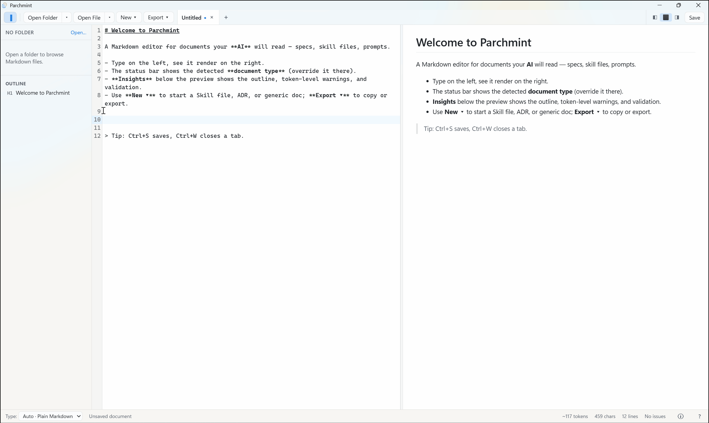

# Parchmint

**A Markdown editor for AI-consumed documents.** Write docs, prompts, and skill files
with an *honest preview* of exactly what the model will read — not a prettified render.

[](LICENSE)
[](https://github.com/MazherUddin/parchmint/actions/workflows/ci.yml)
[](https://github.com/MazherUddin/parchmint/releases/latest)


<p align="center">
  
</p>

> Built and used daily. **v0.1.0** is the first public release — feedback and issues very welcome.

Most Markdown editors optimize for how a document looks to a *human*. When the reader is an
LLM, what matters is the raw text, its structure, and its token cost. Parchmint shows you
that directly — a beautiful preview paired with an honest view of exactly what the model
ingests.

## Features

- **Honest preview** — see what the model actually reads: pseudo-tags like `<what-to-do>`
  render as visible *labeled blocks* instead of silently vanishing, and raw HTML is surfaced
  — not a prettified lie.
- **Insights panel** — live token count, frontmatter validation per document type, a structure
  outline, and lint warnings (unclosed tags, broken links, invisible/zero-width characters).
- **Live agent reconciliation** — when Claude Code or Cursor rewrites an open file on disk,
  Parchmint live-reloads clean tabs and flags conflicts with a side-by-side diff. It never
  clobbers an agent's changes.
- **Document types & templates** — auto-detects Skill files, ADRs, and frontmatter docs
  *non-invasively* (it never edits your text) and scaffolds new ones.
- **Command palette** — `Ctrl`/`Cmd`+`K` runs any command or fuzzy-jumps to any file in
  the workspace, so you never hunt menus or hand-type Markdown: bold/italic, headings,
  lists, links, tables, Mermaid, math, and pseudo-tags are all a keystroke away.
- **Fast source ↔ preview navigation** — jump to any section from the outline, and
  **right-click rendered text to land on its exact source line**.
- **A full Markdown editor, too** — GFM, syntax highlighting, KaTeX math, Mermaid diagrams, a
  tabbed workspace, and export to HTML, PDF, or clipboard.
- **Cross-platform** — Windows, macOS (signed & notarized), and Linux, with native light/dark
  and accent-color theming.

## Install

Download the latest build for your OS from the
[Releases](https://github.com/MazherUddin/parchmint/releases/latest) page.

- **macOS** — open the `.dmg` and drag Parchmint to Applications. Signed & notarized by Apple,
  so it opens normally (on first launch macOS may ask to confirm a download from the Internet
  → **Open**).
- **Windows** — run the `.exe` or `.msi`. The app is currently unsigned, so SmartScreen may
  warn: **More info → Run anyway**.
- **Linux** — download the `.AppImage`, `.deb`, or `.rpm`.

## Build from source

Requires [Node.js](https://nodejs.org), [Rust](https://rustup.rs), and the
[Tauri prerequisites](https://tauri.app/start/prerequisites/) for your platform.

```bash
npm install
npm run tauri dev      # run in development
npm run tauri build    # produce a release build
```

## Contributing

Bug reports, fixes, and ideas are welcome. Parchmint is solo-led — see
[CONTRIBUTING.md](CONTRIBUTING.md) for what's in scope and how PRs are handled. For security
issues, see [SECURITY.md](SECURITY.md).

## License

[MIT](LICENSE) © Abu Mazher Uddin
